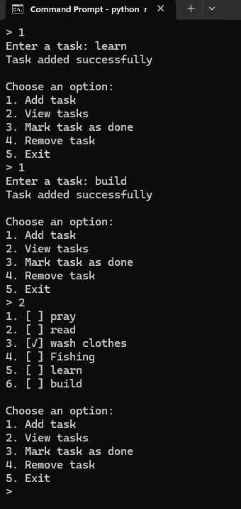
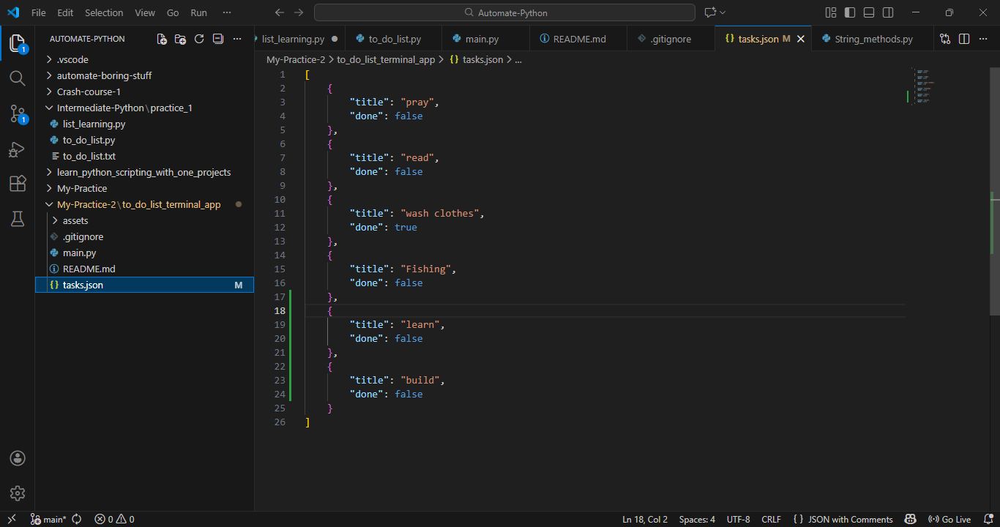

# Terminal To-Do List App (Python)

A simple terminal-based to-do list application built with Python.  
It allows users to add tasks, view tasks, mark tasks as completed, and remove tasks.  
Tasks are saved locally so they persist between sessions.

# Demo image

## Features
- Add new tasks
- View all tasks
- Mark tasks as completed
- Remove tasks
- Persistent storage using JSON
- Clean terminal interface

## Technologies Used
- Python
- JSON for data persistence

## How to Run
1. Clone the repository
2. Run `python main.py`
3. Follow the on-screen menu

## Why This Project
This project demonstrates:
- Python functions and control flow
- File handling and data persistence
- User input validation
- Writing clean, readable code

